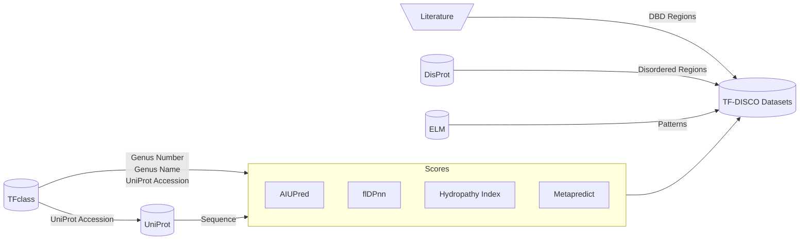

**<h1 align="center">TF-DISCO</h1>**

This is the Streamlit frontend for the [TF-DISCO Datasets](https://kaggle.com/datasets/joejojoestar/tf-disco-datasets) stored in the accompanying Kaggle repository.



# **Requirements**
Check out the [`requirements.txt`](requirements.txt) file.

Recommended: Python 3.13.\
Supported: Python 3.10 – 3.14, as required by Streamlit.

# **Running it locally**

1.  Clone the repo
    ```bash
    git clone https://github.com/tf-disco/tf-disco.git
    cd tf-disco/
    ```

2.  Create an environment (highly recommended) and install requirements.

    Using Conda ([install instructions](https://www.anaconda.com/docs/getting-started/miniconda/install/overview)):
    ```bash
    conda env create # will use environment.yml file automatically
    conda activate tf-disco
    ```

3.  Start Streamlit!
    ```bash
    streamlit run app.py
    ```

<!--
docker build -t dp-bio-temp --build-arg dataset_source=kaggle .
docker run -it -p 8501:8501 dp-bio-temp

docker build -t dp-bio-temp --build-arg dataset_source=copy --build-context dataset_path=../Datasets/ .
docker run -it -p 8501:8501 dp-bio-temp

docker build -t dp-bio-temp --build-arg dataset_source=mount .
docker run -it -p 8501:8501 -v ./Datasets:/tf-disco-dataset dp-bio-temp

-->
