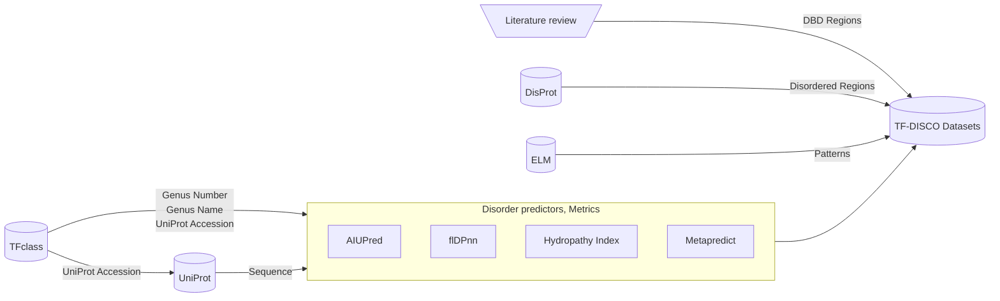
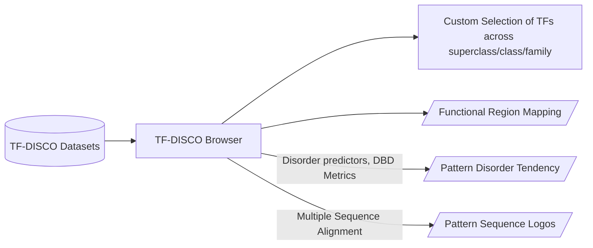
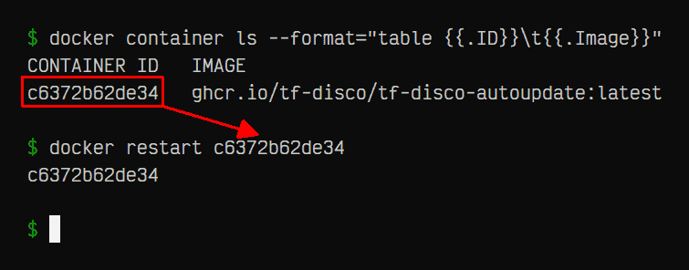

<h1 align="center"><b>TF-DISCO</b></h1>
<p align="center"><sup>A Consolidated database of Disorder, Patterns and Functional annotations of Transcription Factors</sup></p>

This is the Streamlit frontend for the [TF-DISCO Datasets](https://kaggle.com/datasets/joejojoestar/tf-disco-datasets) stored in the accompanying Kaggle repository.

Table of contents:
- [**Pipeline**](#pipeline)
- [**Running the app**](#running-the-app)
  - [Docker (Recommended for Deployment)](#docker-recommended-for-deployment)
  - [Bare metal (Recommended for Development)](#bare-metal-recommended-for-development)
    - [Configuration (.env file)](#configuration-env-file)
- [**Authors**](#authors)
- [**License**](#license)

## **Pipeline**



User workflow:


---

## **Running the app**

There are two ways to run this:

1. [Docker](#docker-recommended-for-deployment) (Recommended for Deployment)
2. [Bare metal](#bare-metal-recommended-for-development) (Recommended for Development)

### Docker (Recommended for Deployment)

This repository contains two `Dockerfiles` and their corresponding
[built images](https://github.com/orgs/tf-disco/packages?repo_name=tf-disco),
ready for use.

- The [`tf-disco` image](https://github.com/tf-disco/tf-disco/pkgs/container/tf-disco)
    is built automatically from the [`Dockerfile`](Dockerfile). The image is
    also available on [Docker Hub Mirror](https://hub.docker.com/repository/docker/joejojoestar/tf-disco).

- The [`tf-disco-autoupdate` image](https://github.com/tf-disco/tf-disco/pkgs/container/tf-disco-autoupdate)
    is built automatically from the [`Dockerfile.autoupdate`](Dockerfile.autoupdate).
    The image is also available on [Docker Hub Mirror](https://hub.docker.com/repository/docker/joejojoestar/tf-disco-autoupdate).

    This image is based on the previous image, with the added feature that it will
    automatically fetch the latest code and dataset changes from the repository
    upon startup. This can be used in environments where a fully-fledged CI/CD
    workflow is not available.

To use either of these images, follow the below instructions:

1. Get the [Docker Engine](https://docs.docker.com/engine/install)

2. Pull the built image from one of the following sources, and start it:

    - GitHub Container Registry
        ```bash
        docker pull ghcr.io/tf-disco/tf-disco:latest
        docker run -it -p 8501:8501 ghcr.io/tf-disco/tf-disco:latest
        ```

        For the `tf-disco-autoupdate` image, use this instead:
        ```bash
        docker pull ghcr.io/tf-disco/tf-disco-autoupdate:latest
        docker run -it -p 8501:8501 ghcr.io/tf-disco/tf-disco-autoupdate:latest
        ```

    - Docker Hub Registry
        ```bash
        docker pull joejojoestar/tf-disco:latest
        docker run -it -p 8501:8501 joejojoestar/tf-disco:latest
        ```

        For the `tf-disco-autoupdate` image, use this instead:
        ```bash
        docker pull joejojoestar/tf-disco-autoupdate:latest
        docker run -it -p 8501:8501 joejojoestar/tf-disco-autoupdate:latest
        ```

    > [!TIP]
    > To keep TF-DISCO up-to-date, it is recommended to simply restart the
    > container periodically, and it'll fetch the latest changes in the main
    > repository. This works only with `tf-disco-autoupdate`.
    >
    > ```bash
    > docker container ls --format="table {{.ID}}\t{{.Image}}" # to get the container ID
    > docker restart CONTAINER_ID
    > ```
    > 

<details>
<summary><b>Building the Image with a Custom Dataset</b></summary>

First, clone the repo locally:
```bash
git clone https://github.com/tf-disco/tf-disco.git
cd tf-disco/
```

There are three ways to **Build** the images from the Dockerfile.

1. Baking the Dataset from Kaggle directly in the Image:
    ```bash
    docker build -t tf-disco --build-arg dataset_source=kaggle .
    docker run -it --name tf-disco -p 8501:8501 tf-disco
    ```

2. Baking the Dataset from a local directory directly in the Image:
    ```bash
    docker build -t tf-disco --build-arg dataset_source=copy --build-context dataset_path=/local/path/to/Datasets/ .
    docker run -it --name tf-disco -p 8501:8501 tf-disco
    ```

3. Mounting a Dataset from a local directory in the Image:
    ```bash
    docker build -t tf-disco --build-arg dataset_source=mount .
    docker run -it --name tf-disco -p 8501:8501 -v /local/path/to/Datasets:/tf-disco-dataset tf-disco
    ```

</details>

### Bare metal (Recommended for Development)

1. Clone the repo
    ```bash
    git clone https://github.com/tf-disco/tf-disco.git
    cd tf-disco/
    ```

2. Create an environment (highly recommended) and install requirements. Python
   3.13 is recommended.

   1. ... using **venv** (ensure you already have Python 3.13 on your system):
        ```bash
        python -m venv .venv
        .venv/Scripts/activate
        pip install -r requirements.txt
        ```

   2. ... using **uv** ([install instructions](https://docs.astral.sh/uv/getting-started/installation)):
        ```bash
        uv sync
        .venv/Scripts/activate
        ```

        Read more at the [uv docs](https://docs.astral.sh/uv/pip/environments/#discovery-of-python-environments) about choosing an existing environment.

   3. ... using **Conda** ([install instructions](https://anaconda.com/docs/getting-started/miniconda/install/overview)):
        ```bash
        conda create -n tf-disco python=3.13
        conda activate tf-disco
        pip install -r requirements.txt
        ```

3. Start Streamlit!
    ```bash
    streamlit run app.py
    ```

#### Configuration ([.env file](.env))

You can set certain configuration options in the [.env file](.env) before you
start the app. Note that these options are considered only when running bare
metal, and are ignored in Docker.

If you have already downloaded the dataset from Kaggle, or if you have a custom
dataset you want to use instead of the Kaggle one, set this variable to override
the dataset path:

> [!NOTE]
> If you are running in Docker, then provide the path via the
> `--build-arg dataset_path=...` argument to `docker build` instead. Read the
> section "Building the Image with a Custom Dataset" above for more info.

```bash
DATASET_PATH_OVERRIDE="path/to/dataset/"
```

If you have already downloaded MUSCLE v5 for your specific architecture, set this
variable to override the MUSCLE path. By default, the Linux x86 version will be
downloaded from <https://github.com/tf-disco/muscle/releases>.

> [!NOTE]
> If you are running in Docker, then MUSCLE is already included, and the below
> variable will be ignored.

```bash
MUSCLE_PATH="path/to/muscle-win64.v5.3.exe"
```

---

## **Authors**

This web app is developed by:
- Joseph Cijo ([GitHub](https://github.com/joejo-joestar), [LinkedIn](https://linkedin.com/in/joseph-cijo), [email](mailto:joecn2704+tfdisco@gmail.com))
- Sreenikethan Iyer ([GitHub](http://github.com/SreenikethanI), [LinkedIn](https://linkedin.com/in/sreenikethan-i), [email](mailto:sreeni.s.iyer+tfdisco@gmail.com))

## **License**

This project is licensed under the [MIT License](LICENSE).
