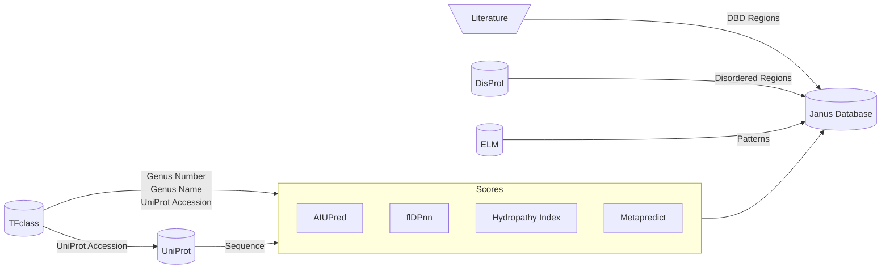

**<h1 align="center">Janus Browser</h1>**

This is the Streamlit frontend for the [Janus Browser Database](https://kaggle.com/datasets/joejojoestar/janus-browser-dataset) stored in the accompanying Kaggle repository.



# **Requirements**
Check out the [`requirements.txt`](requirements.txt) file.

Recommended: Python 3.13.\
Supported: Python 3.10 – 3.14, as required by Streamlit.

# **Running it locally**

1.  Clone the repo
    ```bash
    git clone https://github.com/janus-browser/janus-browser.git
    cd janus-browser/
    ```

2.  Create an environment (highly recommended) and install requirements.

    Using Conda ([install instructions](https://www.anaconda.com/docs/getting-started/miniconda/install/overview)):
    ```bash
    conda env create # will use environment.yml file automatically
    conda activate janus-browser
    ```

3.  Start Streamlit!
    ```bash
    streamlit run app.py
    ```
